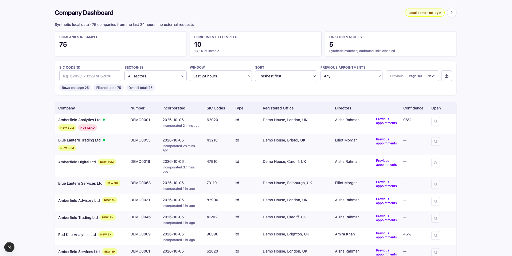
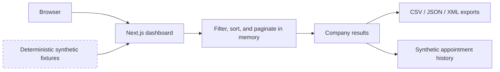
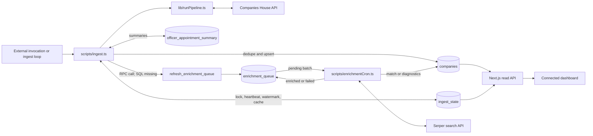
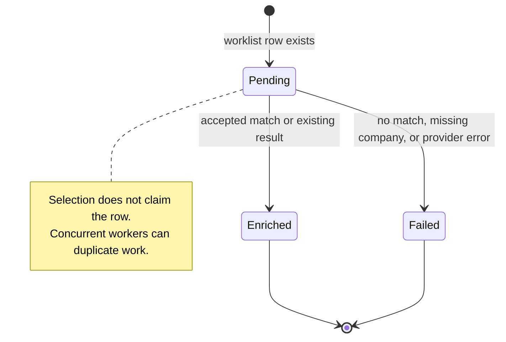

# Companies House Enrichment Pipeline

An incremental Companies House ingestion and enrichment pipeline, presented here as a reproducible Next.js portfolio project. The repository preserves the connected pipeline code and its operational behavior while making a deterministic synthetic demo the safe default.

The two execution paths are deliberately separate: the current demo runs without credentials or external services; the historical implementation connected Companies House, Supabase/Postgres, and Serper. Missing database definitions are documented as gaps rather than reconstructed by assumption.



*Standalone demo using 75 deterministic synthetic companies; no login, credentials, or external service calls required.*

## Run the demo

Requires Node.js 20.9 or later.

```bash
npm ci
npm run dev
```

Open [http://localhost:3000](http://localhost:3000).

To run the complete local verification and then serve the production build:

```bash
npm run check
npm start
```

`npm run check` runs ESLint, TypeScript, focused tests, and a production build. The demo is enabled unless `NEXT_PUBLIC_DEMO_MODE=false` is set explicitly.

## Engineering focus

- **Incremental ingestion:** a persisted watermark defines the next Companies House search window.
- **Boundary resilience:** each run subtracts a two-minute overlap from the watermark so records near a time boundary can be replayed.
- **Owned run locking:** a UUID-owned lock, stale-lock TTL, heartbeat, and owner-checked release reduce overlapping ingest runs.
- **Replay-safe writes:** known-company exclusion, in-batch deduplication, and upsert by `company_number` make repeated windows safe at the application level.
- **Officer-data caching:** raw appointment responses and compact per-officer summaries limit repeat Companies House requests.
- **Persisted enrichment worklist:** pending candidates are score ordered, expiry filtered, attempt bounded, and processed in small batches.
- **Partial-write recovery:** an existing company match lets a later worker complete the queue transition without repeating the paid search.
- **Explicit concurrency limits:** the visible worker has no atomic claim or lease, so concurrent workers can select the same row.

The detailed evidence trail, inferred database requirements, and missing infrastructure are in [docs/architecture.md](docs/architecture.md).

## Two execution paths

### Current: standalone synthetic demo

The default application creates 75 deterministic companies in memory. It supports SIC and sector filters, time windows, previous-appointment filters, sorting, pagination, CSV/JSON/XML export, synthetic appointment history, and representative enrichment outcomes. All company, director, address, and enrichment data is synthetic; outbound profile links are disabled.



This path bypasses Supabase, authentication, the connected API routes, Companies House, Serper, and the optional SearchAPI integration.

### Historical: connected Supabase implementation

The connected path remains visible in the TypeScript source and git history. Its behavior can be reviewed, but it cannot be reproduced from this repository alone because the Supabase DDL, constraints, RLS policies, triggers, and `refresh_enrichment_queue` function are absent.



No managed scheduler configuration is present. `npm run ingest:loop` is a five-minute shell loop, and the enrichment worker is a one-shot command that requires an external invocation mechanism.

## Pipeline semantics

### Incremental ingestion and idempotency

A connected ingest run follows this sequence:

1. Remove a lock only when its heartbeat is older than the configured TTL.
2. Insert an `ingest_lock` row containing the run UUID and keep it alive with a heartbeat.
3. Read `last_processed_at`, subtract a two-minute overlap, and query the Companies House time window.
4. Exclude already-known company numbers, deduplicate the returned batch, and upsert on `company_number`.
5. Cache officer appointments and upsert compact summaries on `officer_id`.
6. Call the missing `refresh_enrichment_queue` RPC after relevant company updates.
7. Advance the watermark only after run-level work succeeds.
8. Release only the lock owned by the current run, including from `finally` after an error.

The overlap intentionally exchanges some duplicate reads for safer boundary handling. Replay safety also depends on database uniqueness constraints implied by the conflict targets; those constraints cannot be verified without the missing schema.

### Enrichment worklist

The worker selects pending, unexpired rows with fewer than two recorded searches, orders them by score, and processes at most ten per invocation. It tries up to two query variants for a director and scores candidates using name, geography, company, leadership, and LinkedIn-domain signals.

The query variants are not HTTP retries. Serper requests have a timeout but no status-aware retry loop, and `failed` is terminal in the visible worker.



This is a durable Postgres worklist, not an exactly-once queue. There is no visible `processing` state, atomic claim, lease, visibility timeout, scheduled retry, or dead-letter mechanism.

### Partial-write recovery

The company update and queue-status update are separate writes. If the company write succeeds and the queue update fails, a later worker run detects the existing LinkedIn result, skips another search, and marks the queue row enriched. This covers that specific failure ordering; it is not a transaction and does not guarantee exactly-once processing.

Companies House calls have separate retry behavior for 429, 5xx, and network/no-response failures. The older optional SearchAPI code also contains retry logic, but it is distinct from the Serper worklist worker and disabled by default.

## Connected-mode boundary

Connected mode is retained for architectural inspection, not offered as turnkey infrastructure. Its commands are:

```bash
npm run ingest:once
npm run ingest:loop
npm run enrich:once
npm run backfill:previous
```

To investigate it, copy `.env.example` to `.env.local`, set `NEXT_PUBLIC_DEMO_MODE=false`, and provide a compatible Supabase project and API credentials. A usable deployment would still need:

- table DDL, indexes, unique constraints, foreign keys, defaults, and triggers;
- RLS policies and the `refresh_enrichment_queue` implementation;
- a deliberate scheduling mechanism;
- server-side authorization for the retained read routes, which currently use the service-role client without authenticating callers;
- an atomic work-claim/retry design if multiple workers are expected.

## Design trade-offs

- A short overlap window improves ingestion continuity while relying on idempotent writes to absorb replay.
- A Postgres worklist keeps state inspectable and colocated with application data, but offers weaker concurrency semantics than a broker or atomically claimed table.
- Officer appointment caching reduces upstream traffic at the cost of cache freshness and storage in a generic key/value table.
- Bounded concurrency and batch sizes protect external services but limit throughput.
- The synthetic demo makes the public project reproducible without presenting absent database infrastructure as complete.

## Repository map

```text
app/                         Next.js dashboard and connected read routes
lib/demoData.ts              Deterministic offline portfolio fixtures
lib/runPipeline.ts           Companies House discovery and normalization
scripts/ingest.ts            Locking, watermarking, caching, upserts, retention
scripts/enrichmentCron.ts    Persisted worklist consumer and match scoring
scripts/backfillPreviousAppointments.ts
companiesHouseClient.ts      Companies House pagination and retry behavior
enrichmentService.ts         Older optional SearchAPI enrichment path
docs/architecture.md         Evidence, diagrams, lifecycle, and missing pieces
tests/                       Focused synthetic-demo tests
```

## Further documentation

[Architecture evidence and boundaries](docs/architecture.md) contains the deeper implementation review: verified versus inferred behavior, the logical data model, ingestion and enrichment state diagrams, retry details, cache behavior, security boundaries, and the precise infrastructure that is not present in the repository.
