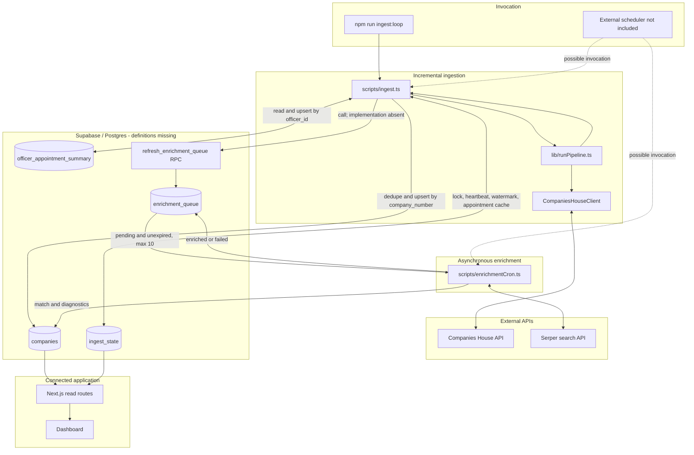
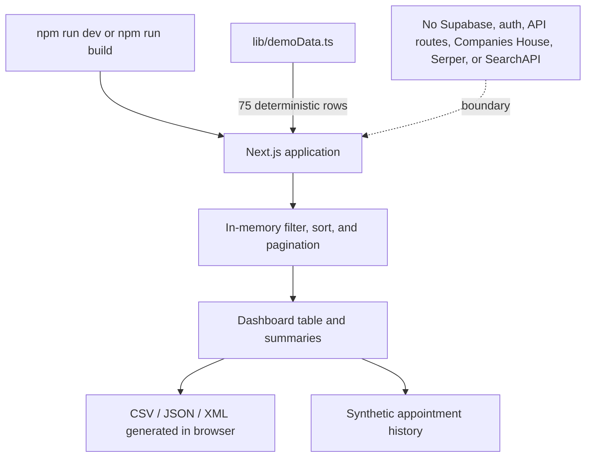
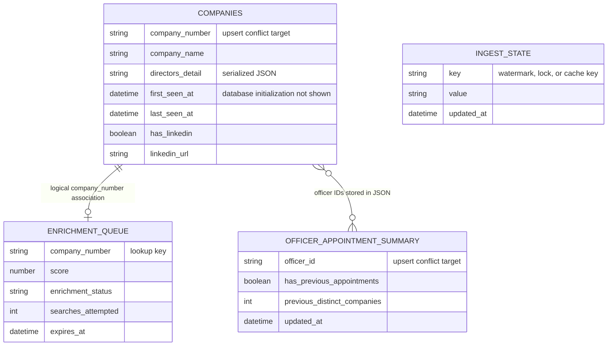
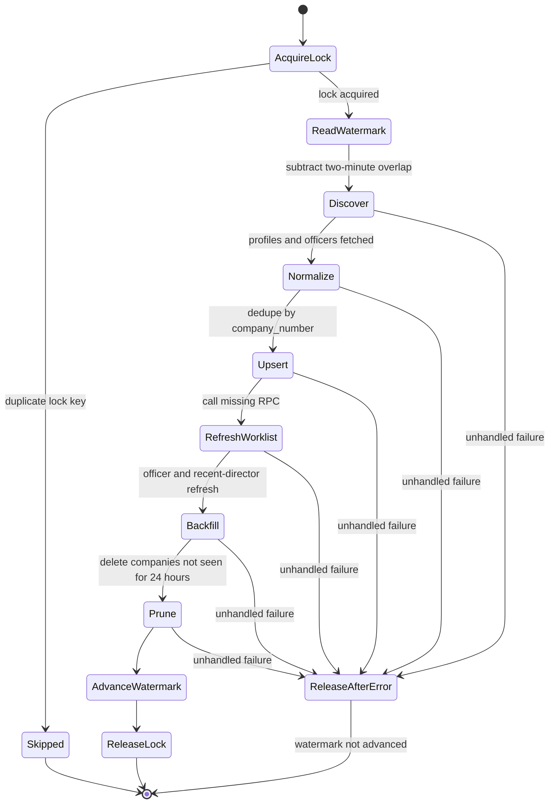
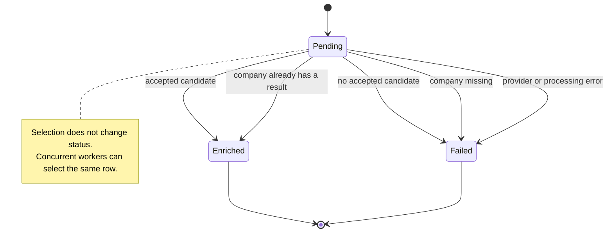

# Architecture evidence and boundaries

This document separates behavior directly visible in the repository from behavior that depends on missing database infrastructure. It describes the connected Supabase implementation as historical architecture and the synthetic application as the current reproducible demo.

## Evidence classification

### Directly verified in code

- Companies House advanced search, profile, officer, and appointment calls.
- Pagination using `start_index` and bounded in-process concurrency.
- Retry/backoff for Companies House 429, 5xx, and network/no-response failures.
- Filtering to active `ltd` company profiles.
- A persisted ingestion watermark and two-minute overlap.
- A run lock with owner UUID, TTL cleanup, heartbeat, and owner-checked release.
- Known-company exclusion, per-batch deduplication, and company upsert on `company_number`.
- Raw officer appointment caching and summary upsert on `officer_id`.
- A call to the `refresh_enrichment_queue` Supabase RPC after relevant company updates.
- Selection of pending, unexpired enrichment rows with fewer than two recorded searches.
- Score-ordered batches of at most ten queue rows.
- Serper candidate scoring and separate company/queue write-back.
- Terminal `enriched` and `failed` outcomes.
- Existing-result detection that avoids another search after one partial-write scenario.
- Five-minute dashboard response caching and five-minute browser polling in connected mode.
- A deterministic, credential-free synthetic demo that bypasses connected services.

### Inferred but not database-verified

- `company_number` must be unique for `upsert(..., { onConflict: "company_number" })` to behave as intended.
- `ingest_state.key` must be unique for duplicate error `23505` to coordinate the run lock.
- `officer_appointment_summary.officer_id` must be unique for its upsert conflict target.
- `first_seen_at` appears to require a database default or trigger because the ingest payload does not set it.
- Logical associations between company, queue, officer, profile, and event records are visible, but foreign keys are not.

### Missing and not reproducible from this repository

- Table DDL, indexes, unique constraints, and foreign keys.
- Supabase migrations and seed data.
- Row-level security policies.
- The `refresh_enrichment_queue` function body, including candidate scoring, expiry, and deduplication.
- Any database trigger or default that initializes `first_seen_at`.
- Production scheduling for ingestion or enrichment.
- Observability configuration and operational dashboards.

### Explicitly not implemented in the visible worker

- A `processing` queue state.
- Atomic row claim, lease, or visibility timeout.
- Exactly-once enrichment.
- Automatic retry/backoff for Serper failures.
- Dead-letter processing.
- A transaction spanning the company update and queue-status update.

## Connected architecture

`npm run ingest:loop` is a shell loop, not evidence of a managed production scheduler. `npm run enrich:once` performs a single batch; no repository configuration schedules it.

## Current demo architecture

The demo is enabled unless `NEXT_PUBLIC_DEMO_MODE=false` is set explicitly. It contains no live company records or outbound profile URLs.

## Logical data model

The following diagram shows application-level associations. It must not be read as verified SQL or foreign-key DDL.

`ingest_state` is intentionally separate in the diagram because its relationship is by conventional key names rather than a visible relational association.

## Ingestion lifecycle

Individual profile, officer-summary, and director-backfill failures are sometimes logged and skipped so other records can progress. An unhandled run-level error releases the lock in `finally` and prevents the final watermark update, allowing the overlapped window to be replayed.

## Enrichment lifecycle and concurrency gap

The queue query checks `searches_attempted < 2`, but an exception is recorded as `failed`, and subsequent selection only reads `pending`. There is no visible scheduled retry of failed work.

## Failure and recovery behavior

### Companies House

The client retries 429, 5xx, and failures without an HTTP response. It prefers `X-RateLimit-Reset`, then numeric `Retry-After`, then exponential backoff with jitter capped at ten seconds. Other 4xx responses fail immediately. Officer-list 404 responses are treated as an empty list so a newly registered company does not fail the entire run; a later recent-director backfill can recover some delayed data.

### Officer cache

Raw appointment lists are stored under `officer_appointments:{officerId}` keys in `ingest_state`. Compact counts are upserted in `officer_appointment_summary`. Missing or stale data is refreshed with bounded concurrency and a configurable per-run cap.

### Enrichment worker

Serper requests have a 15-second timeout but no status-aware retry loop. Weak or disqualified candidates can be stored as diagnostics before the queue row is marked failed.

### Partial write

The worker writes `companies` first and updates `enrichment_queue` second. If only the first write succeeds, the next run's existing-result check can mark the row enriched without repeating the external search. Other cross-table inconsistencies are not transactionally prevented.

## Connected-mode security boundary

The browser verifies a Supabase session before showing the connected dashboard. The retained API routes do not verify that session server-side and use an admin/service-role client. Connected mode should therefore not be exposed publicly until server-side authorization and the missing RLS policy review are completed.

